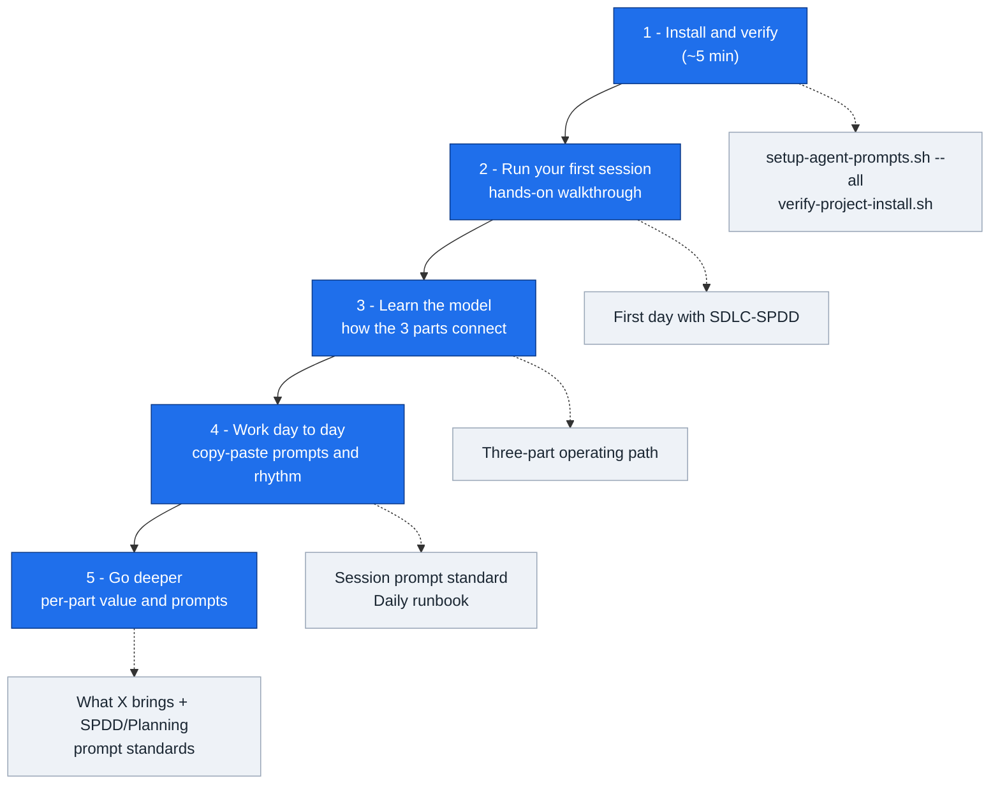

# SDLC-SPDD Orchestrator

A multi-assistant scaffold for disciplined AI-assisted delivery.

**Demo videos:** [Watch three narrated intro segments on GitHub Pages](https://jmjava.github.io/sdlc-spdd-orchestrator/) — SDLC-SPDD overview, install/workflow, and Guide RAG dogfooding.

## Recent highlights

New agent coordination shipped in [#19](https://github.com/jmjava/sdlc-spdd-orchestrator/issues/19) via [#20](https://github.com/jmjava/sdlc-spdd-orchestrator/pull/20) and [#21](https://github.com/jmjava/sdlc-spdd-orchestrator/pull/21) and [#21](https://github.com/jmjava/sdlc-spdd-orchestrator/pull/21)

| What | Why it matters | Try it |
| ---- | -------------- | ------ |
| **SDLC pointer** ([#20](https://github.com/jmjava/sdlc-spdd-orchestrator/pull/20)) | Persistent Work ID on your machine; guarded wrappers refuse commands aimed at the wrong chore | `agent-context/sdlc-pointer.sh` |
| **Workflow CLI** ([#21](https://github.com/jmjava/sdlc-spdd-orchestrator/pull/21)) | Phase/gate tracking, canvas-op inference, and safe session capture | `./scripts/sdlc.sh` or `./scripts/sdlc-spdd/sdlc.sh` |
| **Team registry** ([#21](https://github.com/jmjava/sdlc-spdd-orchestrator/pull/21)) | Shared claims in git so teammates see who owns which Work ID | `./scripts/sdlc.sh team`, `./scripts/sdlc.sh claim …` |
| **Agent grounding** ([#21](https://github.com/jmjava/sdlc-spdd-orchestrator/pull/21)) | `/sdlc-spdd-whereami` in Cursor, Copilot, and Claude — same “what now?” answer as the shell CLI | `/sdlc-spdd-whereami` |

Pointer and workflow state stay local (`.sdlc/pointer`, `.sdlc/workflows/`); team claims live in `agent-context/work-registry.tsv` and sync through git. Details: [agent-context/README.md](agent-context/README.md)

> **Project status: turning the corner from MVP to "make it right."**
> We develop this framework through Kent Beck's progression — *make it work → make it
> right → make it fast*. Phase one (**make it work**) is done: it functions end to end
> today. We are now in **make it right** — refactoring the existing code and docs for
> **readability, maintainability, and extensibility** — before any later **make it
> fast** work (performance and prompt optimization). Expect the surface to keep
> improving. See the [ROADMAP](ROADMAP.md) and [milestone-1.md](milestone-1.md) for the
> current direction and what is in progress.
>
> **We dogfood the framework on itself.** This second-phase work is driven through
> SDLC-SPDD: each improvement is a governed Work ID with its own REASONS Canvas
> under [`spdd/canvas/`](spdd/canvas/) and requirement under
> [`requirements/milestones/`](requirements/milestones/) — the same workflow this
> repo asks target projects to use.
>
> **A note on judging the code right now:** much of this phase is active refactoring.
> Reviewing AI-assisted code before the *make it right* loop is complete is like
> inspecting wet cement and declaring the building unsafe — let the loop finish
> before drawing conclusions about a given area.

Note: Guide integration spike

We are starting an exploratory spike to investigate integrating this project with Guide. Experimental work is being done in the existing spike branch: `cursor/spike-guide-ingest-agent-context-17f4` — https://github.com/jmjava/sdlc-spdd-orchestrator/tree/cursor/spike-guide-ingest-agent-context-17f4

We will continue cleanup and stabilization on `main` while the spike progresses in that branch. Experimental commits and notes will remain on the spike branch until we have a clear plan or stable implementation to merge. No breaking changes to `main` are planned during this spike.

It is built from **three parts** that work together:

| Part         | Answers                                   | Artifacts                                                         |
| ------------ | ----------------------------------------- | ----------------------------------------------------------------- |
| **Planning** | _Why_ the work matters                    | `ROADMAP.md`, `milestone-*.md`, `requirements/`, `session-notes/` |
| **SPDD**     | _What_ to build (and what not to)         | `spdd/canvas/<WORK-ID>.md` (REASONS Canvas)                       |
| **SDLC**     | _Who acts when_ and how sessions hand off | phase commands, session briefs, `agent-context/` memory           |

## How Commands Work

This repo uses **two kinds** of commands. They run in different places — do not mix them up.

| Kind                       | Looks like                                                  | Where you run it                                                             |
| -------------------------- | ----------------------------------------------------------- | ---------------------------------------------------------------------------- |
| **Assistant** (AI chat)    | `/sdlc-spdd-init`, `/sdlc-spdd-plan @requirements/foo.md`   | **Cursor Chat**, **Copilot Chat**, or **Claude Code** in your target project |
| **Shell — install** (once) | `./scripts/setup-agent-prompts.sh --target ...`             | Terminal in the **orchestrator repo** clone                                  |
| **Shell — daily use**      | `./scripts/sdlc-spdd/sdlc.sh next`, `./scripts/sdlc-spdd/sdlc.sh claim …` | Terminal in your **installed target project**                                |
| **Shell — orchestrator**   | `./scripts/sdlc.sh next` (same CLI, orchestrator repo layout)             | Terminal in the **orchestrator repo** clone (dogfooding)                     |

Install/upgrade/verify from the orchestrator clone use `./scripts/<name>.sh`. After install, runtime scripts live in the target at `./scripts/sdlc-spdd/`. See [Script paths](CONTRIBUTING.md#script-paths)

**`/sdlc-spdd-*` is not a terminal command.** Open your target app in Cursor, Copilot, or Claude Code, open **AI chat**, then:

- **Cursor:** type `/sdlc-spdd-init` (or `/` → pick `sdlc-spdd-init`)
- **Copilot:** type `/sdlc-spdd-init`, or `#prompt:sdlc-spdd-init` if slash commands are missing
- **Claude Code:** type `/sdlc-spdd-init` (or `/` → pick `sdlc-spdd-init`)

Full detail: [How to run assistant commands](docs/initialization-and-invocation.md#how-to-run-assistant-commands).

## The Adoption Path

Five steps take you from install to confident daily use. Follow them in order — each step points to one doc.

| Step                | Do this                                                                                      | Read this                                                                    [...]

[rest of file unchanged]
